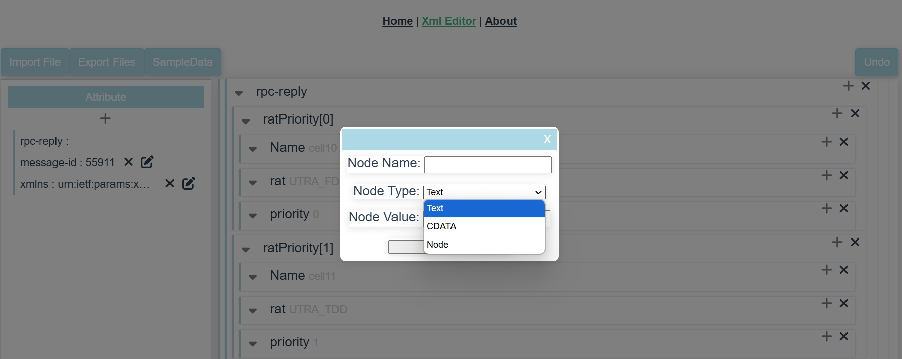

# XML_Editor

using this tool to edit or view xml file.   

get inspiration from another old vue2 js project.  Later based on vue3 dev tool, re-organized this one. Hope it can help for general XML editor.

email: allan.chow@139.com

personally working on java backend more than 10 years, By chance,  got familiar with Vue. I like its design. It's efficient and the code is concise...

good luck!

## Main Screen



## Project setup
```
npm install
```

### Compiles and hot-reloads for development
```
npm run serve
```

### Compiles and minifies for production
```
npm run build
```

### Lints and fixes files
```
npm run lint
```

### Customize configuration
See [Configuration Reference](https://cli.vuejs.org/config/).
